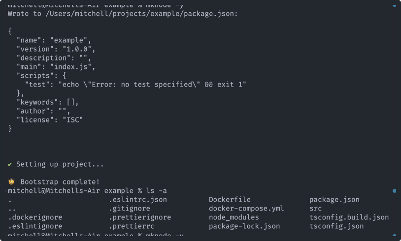

# mknode

Bootstrap Node.js projects with TypeScript, ESLint, Prettier and Docker



## Overview

I got tired of going through the tedious process of setting up NPM packages with everything I need, so I created this tool. It uses my preferred configurations by default but can easily be configured to use yours instead.

After installation, the configuration data for every file can be found in `~/.config/mknode.json`. Edit that file to change the data that new projects will be initialized with. For example, if you want every project to include [nodemon](https://www.npmjs.com/package/nodemon), then add `nodemon` to the `devDependencies` array.

## Installation

```
npm i -g mknode
```

Or use with npx:

```
npx mknode
```

## Usage

The CLI works like `npm init`. Just execute the following command and follow the prompts:

```
mknode
```

Or skip the prompts:

```
mknode -y
```
